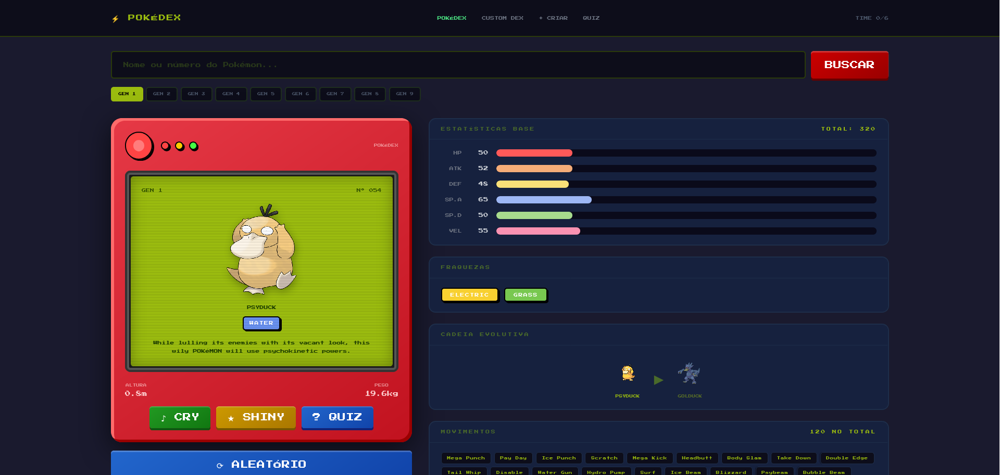
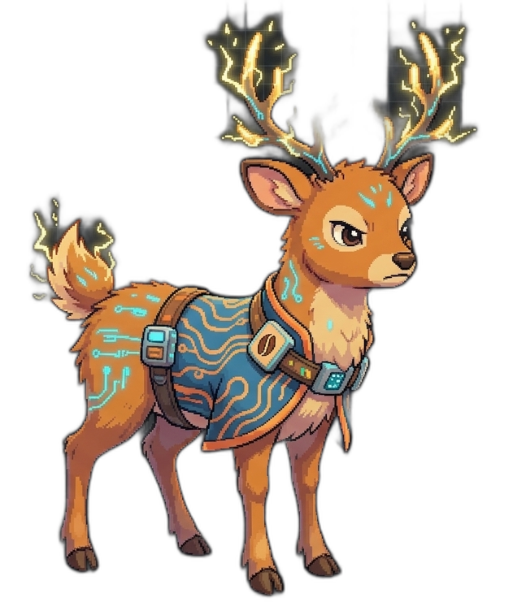
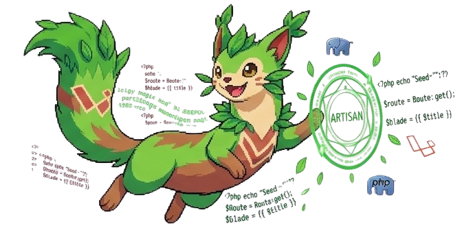
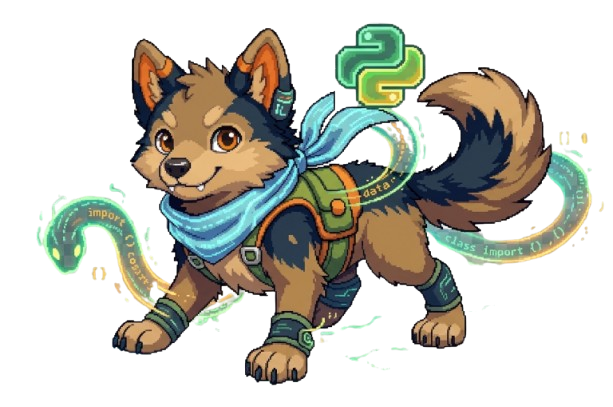

# POKÉDEX CUSTOM EDITION



**SENAI Limeira · Técnico em Desenvolvimento de Sistemas**
Laravel 13 · PokéAPI · MySQL · Pokémons gerados por Nano Banana 2

---

## Sumário

- [Sobre o Projeto](#sobre-o-projeto)
- [Funcionalidades](#funcionalidades)
- [Stack](#stack)
- [Estrutura do Projeto](#estrutura-do-projeto)
- [Controllers](#controllers)
- [Models](#models)
- [Banco de Dados](#banco-de-dados)
- [Rotas](#rotas)
- [Setup Local](#setup-local)
- [Custom Pokémons](#custom-pokémons)
- [Comparativo](#comparativo)

---

## Sobre o Projeto

Pokédex completa com duas seções integradas: a **Pokédex oficial** (dados da PokéAPI) e o **Custom DEX** (Pokémons originais criados com IA). Inclui sistema de quiz, gerenciamento de time, cry com visualizador de onda e upload de sprites.

---

## Funcionalidades

| Módulo | Recurso |
| ------ | ------- |
| **Pokédex** | Busca por nome ou número, seletor de geração (1–9), sprite normal/shiny |
| **Pokédex** | Stats, fraquezas, cadeia evolutiva, movimentos, flavor text |
| **Pokédex** | Cry com áudio oficial + visualizador de onda em tempo real |
| **Time** | Montar time de até 6 Pokémons, persistido em sessão |
| **Quiz** | Adivinhe o Pokémon pela silhueta, streak, precisão, dificuldade por geração |
| **Custom DEX** | Listagem, detalhes, criação com upload de sprite |
| **Custom DEX** | Ataques customizados (até 4 por Pokémon) |
| **Custom DEX** | Cry procedural gerado via Web Audio API (único por Pokémon) |
| **Custom Quiz** | Quiz de silhueta para os Pokémons criados |

---

## Stack

- **Backend:** Laravel 13 (PHP 8.2+)
- **Banco de dados:** MySQL / MariaDB
- **Frontend:** Blade + Tailwind CSS (CDN) + Press Start 2P (Google Fonts)
- **API externa:** [PokéAPI v2](https://pokeapi.co/)
- **Áudio:** Web Audio API (cry procedural no Custom DEX; áudio oficial na Pokédex)
- **Sprites IA:** Gemini Imagen (Google)

---

## Estrutura do Projeto

```
pokedex/
├── app/
│   ├── Http/
│   │   └── Controllers/
│   │       ├── PokemonController.php
│   │       └── CustomPokemonController.php
│   └── Models/
│       ├── User.php
│       └── CustomPokemon.php
├── database/
│   ├── migrations/
│   └── seeders/
│       └── CustomPokemonSeeder.php
├── public/
│   └── sprites/
├── resources/
│   └── views/
├── routes/
│   └── web.php
└── storage/
    └── app/public/   ← sprites enviados via upload
```

---

## Controllers

### `PokemonController`

Gerencia a Pokédex oficial (PokéAPI) e o time.

| Método | Descrição |
|--------|-----------|
| `index()` | Lista Pokémons com filtro por geração e busca por nome/número |
| `quiz()` | Inicia o quiz de silhueta (PokéAPI) |
| `guess()` | Processa a resposta do quiz e atualiza streak/precisão |
| `addToTeam()` | Adiciona um Pokémon ao time (sessão, máx. 6) |
| `removeFromTeam()` | Remove um Pokémon do time |
| `parseEvolutionChain()` | Helper privado para montar a cadeia evolutiva |

### `CustomPokemonController`

CRUD completo para os Pokémons customizados.

| Método | Descrição |
|--------|-----------|
| `index()` | Lista todos os Pokémons custom ordenados por `dex_number` |
| `create()` | Exibe o formulário de criação |
| `store()` | Valida e persiste um novo Pokémon (com upload de sprite) |
| `show()` | Exibe os detalhes de um Pokémon custom |
| `edit()` | Exibe o formulário de edição |
| `update()` | Valida e atualiza os dados (substitui sprite se enviada) |
| `destroy()` | Remove o registro e o arquivo de sprite do storage |
| `quiz()` | Inicia o quiz de silhueta do Custom DEX |
| `guess()` | Processa a resposta do quiz custom |

---

## Models

### `CustomPokemon`

Tabela: `custom_pokemons`

| Campo | Tipo PHP | Descrição |
|-------|----------|-----------|
| `dex_number` | `int` | Número único na Pokédex |
| `name` | `string` | Nome do Pokémon |
| `type_primary` | `string` | Tipo principal |
| `type_secondary` | `string\|null` | Tipo secundário |
| `base_animal` | `string` | Animal inspirador |
| `inspiration` | `string` | Tema / linguagem de programação |
| `hp` | `int` | Stat HP (1–255) |
| `attack` | `int` | Stat Ataque (1–255) |
| `defense` | `int` | Stat Defesa (1–255) |
| `speed` | `int` | Stat Velocidade (1–255) |
| `sprite_path` | `string\|null` | Caminho relativo ao storage |
| `attacks` | `array` (cast JSON) | Até 4 ataques customizados |

### `User`

Tabela: `users` — modelo padrão do Laravel, usado para autenticação futura.

| Campo | Tipo |
|-------|------|
| `name` | `string` |
| `email` | `string` (único) |
| `password` | `hashed` |

---

## Banco de Dados

### Migrations

| Arquivo | Tabelas criadas |
|---------|-----------------|
| `0001_01_01_000000_create_users_table` | `users`, `password_reset_tokens`, `sessions` |
| `0001_01_01_000001_create_cache_table` | `cache`, `cache_locks` |
| `0001_01_01_000002_create_jobs_table` | `jobs`, `job_batches`, `failed_jobs` |
| `2026_05_07_224323_create_custom_pokemons_table` | `custom_pokemons` |
| `2026_05_07_231913_add_attacks_to_custom_pokemons_table` | coluna `attacks` (JSON) em `custom_pokemons` |

### Estrutura — `custom_pokemons`

| Coluna | Tipo | Descrição |
|--------|------|-----------|
| `id` | BIGINT PK auto | Chave primária |
| `dex_number` | INT único | Número na Pokédex |
| `name` | VARCHAR | Nome do Pokémon |
| `type_primary` | VARCHAR | Tipo principal |
| `type_secondary` | VARCHAR null | Tipo secundário |
| `base_animal` | VARCHAR | Animal inspirador |
| `inspiration` | TEXT | Tema / linguagem |
| `hp` | INT (default 50) | Stat HP (1–255) |
| `attack` | INT (default 50) | Stat Ataque (1–255) |
| `defense` | INT (default 50) | Stat Defesa (1–255) |
| `speed` | INT (default 50) | Stat Velocidade (1–255) |
| `sprite_path` | VARCHAR null | Caminho da imagem (storage) |
| `attacks` | JSON null | Array de até 4 ataques |
| `created_at` | TIMESTAMP | — |
| `updated_at` | TIMESTAMP | — |

### Estrutura — `users`

| Coluna | Tipo | Descrição |
|--------|------|-----------|
| `id` | BIGINT PK auto | Chave primária |
| `name` | VARCHAR | Nome do usuário |
| `email` | VARCHAR único | E-mail |
| `email_verified_at` | TIMESTAMP null | Verificação de e-mail |
| `password` | VARCHAR | Senha (hashed) |
| `remember_token` | VARCHAR null | Token "lembrar-me" |
| `created_at` | TIMESTAMP | — |
| `updated_at` | TIMESTAMP | — |

---

## Rotas

| Método | URL | Controller#Método | Nome |
|--------|-----|-------------------|------|
| GET | `/` | `PokemonController@index` | `pokedex` |
| GET | `/pokedex` | `PokemonController@index` | — |
| GET | `/quiz` | `PokemonController@quiz` | `quiz` |
| POST | `/quiz` | `PokemonController@guess` | `quiz.guess` |
| POST | `/pokedex/team/add` | `PokemonController@addToTeam` | `team.add` |
| POST | `/pokedex/team/remove` | `PokemonController@removeFromTeam` | `team.remove` |
| GET | `/custom-pokemons` | `CustomPokemonController@index` | `custom-pokemons.index` |
| GET | `/custom-pokemons/criar` | `CustomPokemonController@create` | `custom-pokemons.create` |
| POST | `/custom-pokemons` | `CustomPokemonController@store` | `custom-pokemons.store` |
| GET | `/custom-pokemons/quiz` | `CustomPokemonController@quiz` | `custom-pokemons.quiz` |
| POST | `/custom-pokemons/quiz` | `CustomPokemonController@guess` | `custom-pokemons.guess` |
| GET | `/custom-pokemons/{id}` | `CustomPokemonController@show` | `custom-pokemons.show` |
| GET | `/custom-pokemons/{id}/editar` | `CustomPokemonController@edit` | `custom-pokemons.edit` |
| PUT | `/custom-pokemons/{id}` | `CustomPokemonController@update` | `custom-pokemons.update` |
| DELETE | `/custom-pokemons/{id}` | `CustomPokemonController@destroy` | `custom-pokemons.destroy` |

---

## Setup Local

### 1. Clonar e instalar dependências

```bash
git clone <repo-url>
cd pokedex
composer install
cp .env.example .env
php artisan key:generate
```

### 2. Configurar banco de dados

Edite `.env`:

```env
DB_CONNECTION=mysql
DB_HOST=127.0.0.1
DB_PORT=3306
DB_DATABASE=pokedex
DB_USERNAME=root
DB_PASSWORD=sua_senha
```

### 3. Migrations e seed

```bash
php artisan migrate
php artisan db:seed --class=CustomPokemonSeeder
```

### 4. Link de storage (para upload de sprites)

```bash
php artisan storage:link
```

### 5. Iniciar servidor

```bash
php artisan serve
```

Acesse: `http://localhost:8000`

---

## Custom Pokémons

Três Pokémons originais com tema de linguagens de programação, sprites gerados pelo **Gemini Imagen**.

---

### #6388 — JAVEER



> *"Seu ódio pelo JavaScript é tão intenso que os chifres disparam raios espontâneos quando detecta código `.js` nas proximidades."*

| Campo | Detalhe |
|-------|---------|
| **Categoria** | Cervo Circuito |
| **Animal base** | Cervo de Nara |
| **Tipo** | Electric / Steel |
| **Inspiração** | Linguagem Java |

| Stat | Valor |
|------|------:|
| HP | 70 |
| Ataque | 85 |
| Defesa | 80 |
| Velocidade | 65 |
| **Total** | **300** |

| Golpe | Descrição |
|-------|-----------|
| **ByteStrike** | Choque elétrico pelos chifres que compila o inimigo no lugar. |
| **GarbageCollect** | Remove todos os buffs do inimigo — limpa a memória do campo. |
| **NullPointer** | Ataque psíquico que deixa o inimigo em confusão total. |
| **JVM Crash** | Carregado por 3 turnos; causa dano devastador ao executar. |

---

### #6389 — ARTISAUR



> *"Carrega os símbolos sagrados do Laravel, PHP e Artisan. Executa comandos mágicos com um simples toque das patas."*

| Campo | Detalhe |
|-------|---------|
| **Categoria** | Furão Framework |
| **Animal base** | Furão |
| **Tipo** | Grass / Psychic |
| **Inspiração** | PHP + Laravel Artisan |

| Stat | Valor |
|------|------:|
| HP | 65 |
| Ataque | 70 |
| Defesa | 55 |
| Velocidade | 90 |
| **Total** | **280** |

| Golpe | Descrição |
|-------|-----------|
| **Artisan Slash** | Garra verde que causa dano e reduz a velocidade do alvo. |
| **Migration Wave** | Altera o campo e muda os tipos dos Pokémons inimigos. |
| **Blade Cut** | Corte psíquico que ignora metade da resistência do alvo. |
| **Composer Install** | Cura o time aliado — mas o Artisaur fica parado por 2 turnos. |

---

### #6390 — PYRANIX



> *"Rodeado por serpentes de dados e comandos `import` flutuantes. O símbolo do Python brilha sobre sua cabeça ao usar ataques especiais."*

| Campo | Detalhe |
|-------|---------|
| **Categoria** | Lobo Script |
| **Animal base** | Lobo |
| **Tipo** | Water / Dark |
| **Inspiração** | Python |

| Stat | Valor |
|------|------:|
| HP | 75 |
| Ataque | 90 |
| Defesa | 60 |
| Velocidade | 95 |
| **Total** | **320** |

| Golpe | Descrição |
|-------|-----------|
| **Serpent Import** | Invoca cobra de dados que envenena o inimigo a cada turno. |
| **IndentError** | Paralisa o inimigo por erro de estrutura — 2 turnos sem agir. |
| **PipInstall** | Absorve força do inimigo e transfere para o Pyranix. |
| **Lambda Fang** | Sempre ataca primeiro, independente da velocidade. |

---

## Comparativo

| Pokémon | HP | Ataque | Defesa | Velocidade | Total |
| ------- | -- | ------ | ------ | ---------- | ----- |
| Javeer (Electric/Steel) | 70 | 85 | 80 | 65 | **300** |
| Artisaur (Grass/Psychic) | 65 | 70 | 55 | 90 | **280** |
| Pyranix (Water/Dark) | 75 | 90 | 60 | 95 | **320** |

---

*Sprites gerados por Gemini Nano Banana 2 (Google) · Laravel 13 + PokéAPI v2*
